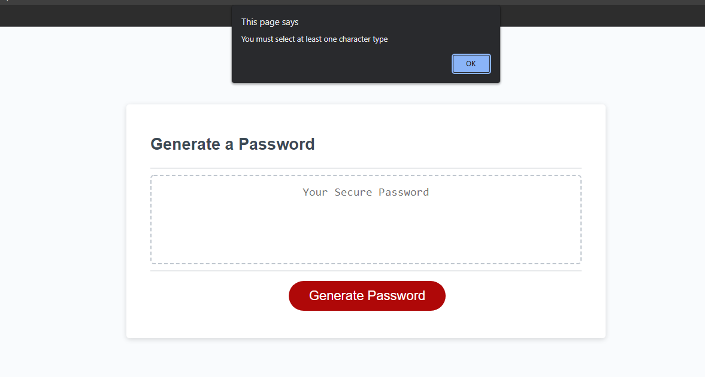
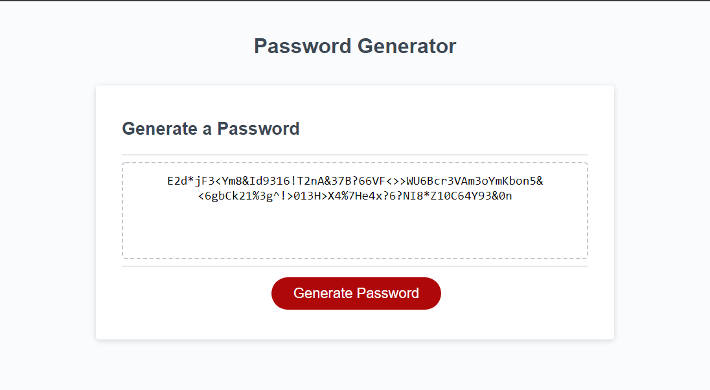

# <Random_Password_Generator>

## Description

For this project, I have created majority of javascript code from a template. The template included the HTML and CSS files, as well as the connecting code for the .js file. I undertook this talk to improve my understanding of basic JavaScript and its components. I solved issues and utilized the following:
- utilizing functions, arrays, variables, boolean, for-loops, and more
- troubleshooting with browser console
- creating dependant and nested variables and functions
- utilizing scope to prevent errors

## Usage

Feel free to dissect the attached files to se what I did under the hood. You can also find the live webpage at https://ryanh610.github.io/Random_Password_Generator/

## Credits

Tutor: Jordan Biason
Friendly guidance: Bernard Morelos

## License

MIT License

Copyright (c) 2022-present Ryan Howley and other contributors

Permission is hereby granted, free of charge, to any person obtaining
a copy of this software and associated documentation files (the
"Software"), to deal in the Software without restriction, including
without limitation the rights to use, copy, modify, merge, publish,
distribute, sublicense, and/or sell copies of the Software, and to
permit persons to whom the Software is furnished to do so, subject to
the following conditions:

The above copyright notice and this permission notice shall be
included in all copies or substantial portions of the Software.

THE SOFTWARE IS PROVIDED "AS IS", WITHOUT WARRANTY OF ANY KIND,
EXPRESS OR IMPLIED, INCLUDING BUT NOT LIMITED TO THE WARRANTIES OF
MERCHANTABILITY, FITNESS FOR A PARTICULAR PURPOSE AND
NONINFRINGEMENT. IN NO EVENT SHALL THE AUTHORS OR COPYRIGHT HOLDERS BE
LIABLE FOR ANY CLAIM, DAMAGES OR OTHER LIABILITY, WHETHER IN AN ACTION
OF CONTRACT, TORT OR OTHERWISE, ARISING FROM, OUT OF OR IN CONNECTION
WITH THE SOFTWARE OR THE USE OR OTHER DEALINGS IN THE SOFTWARE.
